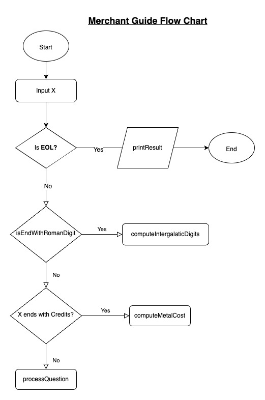
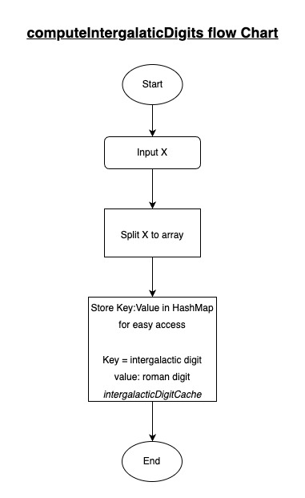
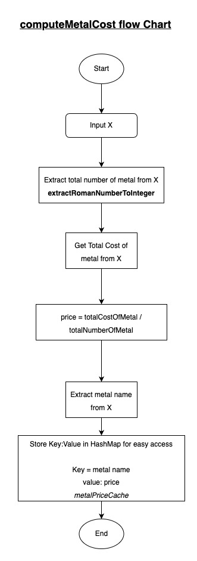
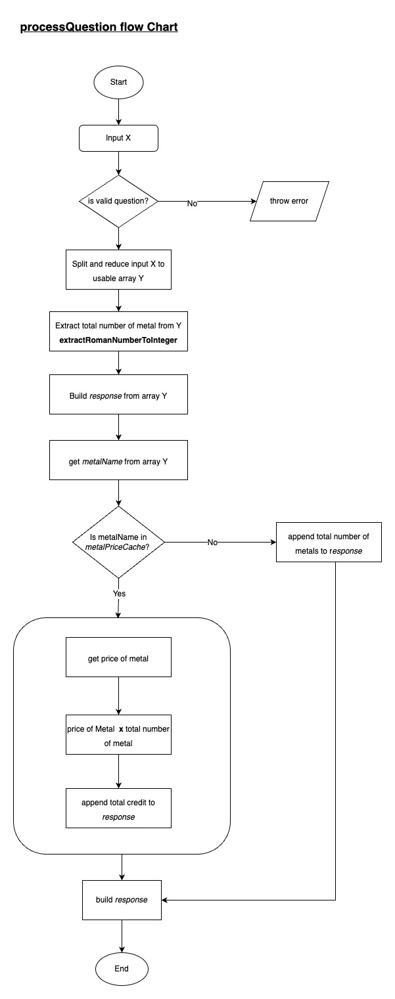

# Merchant Guide Application

This answers the 3rd question in the Coding Challenge

## Flow Chart

The Flow chart shows the execution Process from top to bottom for easy understanding
### Main Flow Chart
Main Execution flow

The main flow chart contains 3 sub methods which I have included the flow charts as below

### ComputeIntergalacticDigits Flow Chart

### ComputeMetalCost Flow Chart

### ProcessQuestion Flow Chart

There are more algorithm in the codebase, for example the algorithm I came up with to convert Roman Digits to Integers, but that has been left out for brevity.

## Assumptions
 - It is assumed that intergalactic digit and roman digit conversion unit are 3 word after trimming e.g. `glob is I`
 - It is assumed that total cost of metals ends with `Credits` e.g. `> glob glob Silver is 34 Credits`
 - It is assumed that the metal name is 4th the right in cost of metals input e.g. as above `Silver`
 - It is assumed that to calculate intergalactic digits and/or metals input ends with `?` 
 - it is assumed that the metal is only mentioned as the last object in the question input. e.g. `> how many Credits is glob prok Iron ?`
 - it is assumed that in question inputs, everything before `is` is irrelevant for faster processing.
 - It is assumed that merchant can enter any form of valid and invalid input.

## Execution

After providing Line by Line input in the console, the program can be terminated by `EOL` which means end of line, and if any questions had been process the result will be printed out.

This repository makes use of JDK 17 and maven 3.8.5

please make sure they are both in classpath

### Running Tests
To run the test cases attached to this Codebase, please run the command below
 - mvn clean
 - mvn test

### Run application 
To run the application please run the commands below
- mvn clean
- mvn compile
- mvn package
- java -jar target/MerchantGuide-1.0-SNAPSHOT.jar

